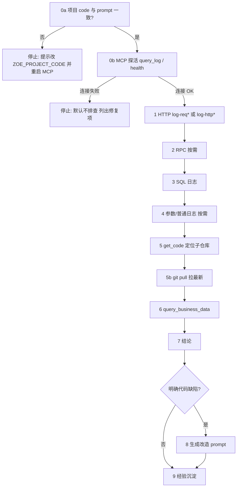

# linx 生产问题排查工作流

> **每次生产排查必读。** 有 traceId 且目的是查现场问题 → 走本工作流，**验证前不改代码**。  
> 排查 Skill：`.cursor/skills/his-log-diagnosis/SKILL.md`  
> MCP：`user-zoe-his-mcp`（经 linx 或直连 API）

---

## 进度清单

```
生产排查进度:
- [ ] 0. 确认项目与连接方式（直连 / 经 linx）
- [ ] 1. HTTP 入口 + requestParam（旧架构注意 log-req*）
- [ ] 2. RPC / 下游（按需）
- [ ] 3. SQL 执行记录
- [ ] 4. 参数 / 普通日志（按需）
- [ ] 5. 代码定位（get_code 本地优先，确定子仓库）
- [ ] 5b. 本地代码拉取最新（git pull）
- [ ] 6. 业务数据 SELECT 验证
- [ ] 7. 结论输出
- [ ] 8. 代码缺陷 → 生成改造 prompt（见 Step 8）
- [ ] 9. 经验沉淀（可复用模式 → cases，见 Step 9）
```

---

## 流程总览



---

## Step 0 — 确认项目与连接（门禁，未通过则停止）

排查对象是**某家医院现场**的问题时，Step 0 为硬门禁：**MCP 连不上 → 默认不进入 Step 1–7**；**项目配错 → 提示用户改项目并重启 MCP**，不得用脚本绕过 MCP 继续查日志/库。

### 0a. 项目是否一致

| 检查 | 动作 |
|------|------|
| 用户 prompt 里的【项目】与 `~/.cursor/mcp.json` 中 `ZOE_PROJECT_CODE` 不一致 | **停止排查**，明确告知当前 MCP 项目 code 与应对 code，请用户修改 `ZOE_PROJECT_CODE` 后**重启 MCP** |
| 一致 | 继续 0b |

项目名 → code 对照见下方「项目对照表」（如 漳州二院 → `zzey`，福鼎 → `fjfd`）。

### 0b. MCP 是否可用

用 **`query_log(traceId)`**（或经 linx 时先 `GET {LINX_BASE_URL}/health`）做探活：

| 结果 | 动作 |
|------|------|
| 配置类错误（未设置 API 地址、项目不存在等） | **停止排查**，列出缺失项与应改文件（`mcp.json` / `projects.json` / `.env`） |
| linx **401**（API Key 错误） | **停止排查**，提示从 `{LINX_BASE_URL}/admin/` 复制最新 `apiKey` 更新 `zoe-his-mcp/projects.json` 对应项，**无需改 mcp.json 项目 code** |
| linx **health 失败** / relay 超时 / 直连 Redis·DB 超时 | **停止排查**，说明现场网络或 linx 未就绪；**默认不用**本地脚本直连内网代替 MCP |
| 探活成功但「未找到 traceId」 | 可进入 Step 1–7（属数据问题，非连接问题） |

**允许继续的例外（须用户明确要求）**：仅做本地 `get_code` 读代码、不查日志/业务库。

### 0c. 连接配置核对

| 检查项 | 说明 |
|--------|------|
| `ZOE_PROJECT_CODE` | 当前医院缩写，与 linx 后台项目 id 一致 |
| 经 linx | `projects.json` 中 `viaLinx` + `linxBaseUrl` + `linxApiKey`（可被 `ZOE_<code>_LINX_*` 覆盖） |
| 直连 | 配置 `ZOE_<code>_API_BASE_URL`，**不要**设 `VIA_LINX` |
| 旧架构 | `ZOE_<code>_LOG_ARCHITECTURE=legacy` + `ZOE_<code>_API_LOG_PATH=/log/search` |
| 新架构 | 默认 onelink；路径多为 `/log-manage-service/log/search`，HTTP 索引 `log-http*` |

**健康检查**

- 经 linx：`GET {LINX_BASE_URL}/health`（福鼎 **9081**、漳州二院 **9082**）
- 注意：**9080 通常是 frp 默认页，不是 linx**；各院 FRP 映射端口以现场为准

---

## Step 1–6 — 排查链路

与 Skill `his-log-diagnosis` 一致：

1. `query_log` — 旧架构 HTTP 在 **`log-req*`**，必看 `requestParam`
2. `query_rpc_log` — 网关成功业务失败时必做
3. `query_sql_log` — 以返回的真实 SQL、绑参、resultCount 为准
4. `query_param_log` / `query_normal_log` — 按需
5. `get_code` — **本地优先**（`local-code-paths.json`），GitLab 回退；记录返回的 `localPath` / `repositoryName`
6. **本地 git 同步** — 见下方 Step 5b
7. `query_business_data` — 仅 SELECT，用于证伪/证实

**硬约束：** 结论须日志 + SQL + 代码交叉验证；验证前不改生产代码。

### Step 7 — 结论输出

按 Skill 格式输出：一句话结论、关键证据、根因、修复建议（配置/数据/代码分类）。

### Step 8 — 明确为代码问题时，生成改造 prompt

**触发条件**（须同时满足）：

- 根因已用**当前 traceId** 的日志 + SQL + 代码 +（可选）业务数据交叉验证；
- 修复方向是**改代码**（非纯运维配参、非纯补数据可一劳永逸）；
- 已定位到**仓库、文件、方法**（`get_code` 的 `localPath` / `repositoryUrl`）。

**不触发**：仅配置/数据问题、需新 traceId 才能证实、或用户未要求进入改造阶段。

**输出位置**：结论末尾单独一节「改造 prompt」，整段可复制到新 Cursor 会话直接开干。

**改造 prompt 模板**（Agent 填空，勿留 `{}` 占位符）：

```text
请按下列已核实结论改代码，不要重新猜根因。

【项目】
（医院名 / ZOE_PROJECT_CODE）

【traceId】
（本次排查 traceId）

【现象】
- 接口 / 菜单：
- 报错：（异常类 + HTTP 状态 + exMsg）
- requestParam：（完整 JSON）

【根因】（已日志+SQL+代码验证）
- 文件：`仓库相对路径` → `类#方法`（约第 N 行）
- 说明：（1–3 句，写清 null/分支/入参问题）

【改造要求】
1. （主修复：判空 / 校验 / 分支，写具体行为）
2. （可选：关联需求，如 [202235] 空日期防护）
3. 保持现有命名与风格；最小 diff；不重构无关逻辑

【仓库】
- 本地路径：（get_code localPath）
- 分支 / tag：（日志或发布线索，无则 master）

【测试要点】
- （复现步骤 + 期望结果）
- （回归：原正常场景不受影响）

【约束】
- 先改代码，不要先改生产数据
- 改完说明改了哪几个文件、各解决什么
```

### Step 9 — 经验沉淀（排查记忆库）

参考 fj-common [docs/memory](D:/zoe_work_space/fj-common/docs/memory/) 模式：**已验证、可复用的生产排查结论**写入 Skill 案例库，供后续 traceId 检索作「待验证假设」，禁止未交叉验证就当定论。

| 时机 | 动作 |
|------|------|
| **排查开始前**（可选） | Read `.cursor/skills/his-log-diagnosis/cases.md` + 若有 `docs/memory/index.md` 按关键词检索 |
| **排查结束后** | 若形成可复用模式（如「SQL 除零」「绑参类型错误」）→ 更新 `cases.md` 简表或新建 CASE（用户要求沉淀时） |
| **升格 workflow/skill** | 在 case 或结论中勾选建议；**不自动改**权威文档，等人确认 |

**linx 排查案例库位置**

| 文件 | 用途 |
|------|------|
| `.cursor/skills/his-log-diagnosis/cases.md` | 典型防误导案例（CASE-001…） |
| `docs/memory/`（可选，与 fj-common 对齐） | 院级长篇 case + index；结构见 fj-common `docs/memory/README.md` |

**简表模式示例**（写入 cases.md 常见模式表，保持 ≤10 行）：

| 现象 | 先查 | 勿踩坑 |
|------|------|--------|
| ORA-01476 除数为 0 | SQL 日志完整 UPDATE 语句，找 `/cost` 分母 | 勿只改 Java 未改 Mapper XML |

**viaLinx 项目配置备忘**：`projects.json` 中 `viaLinx: true` 的项须带 `"apiBaseUrl": "http://linx-relay-placeholder"`，否则 MCP 报「未配置 API 基础地址」。

---

### Step 5 — 代码定位

1. `list_code_repositories`（可选）→ `get_code(serviceName, sqlId, urlPath)` 匹配子仓库  
2. 记下 `data.localPath`（本地）或 `data.repositoryUrl`（GitLab）  
3. 再 `get_code(..., filePath, searchPattern)` 读方法体  

### Step 5b — 本地代码拉取最新

**在 Step 5 确定子仓库后立即执行**，避免本地代码落后于生产：

```bash
cd <get_code 返回的 localPath，或 repositoryUrl 末段对应目录>
git fetch origin
git checkout <分支>    # 默认 master；有发布 tag 则 checkout 对应 release 分支
git pull origin <分支>
```

| 项目 | 本地根目录 | 示例子仓库 |
|------|------------|------------|
| 福鼎 `fjfd` | `D:\zoe_work_space\旧架构日常需求\fj-fd` | `zoe-optimus-fj-fd` |
| 新架构 `zzey` 等 | `D:\zoe_work_space\fj-common` | `onelink-micro-charge-fj-common` |

- 分支以日志中的发布 **tag/branch** 为准；无线索时用仓库 `defaultBranch`（通常 `master`）  
- **仅 pull，不 commit/push**（生产排查只读）  
- 若 `localPath` 不存在：先 clone 对应 GitLab 仓库到本地根，或让 `get_code` 回退 GitLab  
- pull 完成后**再**执行带 `filePath` 的 `get_code` 或 Read 本地文件

---

## 项目切换（只改一个变量）

**`~/.cursor/mcp.json` 只需设置 `ZOE_PROJECT_CODE`**，其余连接信息在 `zoe-his-mcp/projects.json` 中维护（linx URL/API Key、legacy 日志路径等）。改后 **重启 Cursor MCP**。

```json
"env": {
  "NODE_TLS_REJECT_UNAUTHORIZED": "0",
  "ZOE_PROJECT_CODE": "fjfd"
}
```

切换漳州二院：把 `"fjfd"` 改成 `"zzey"` 即可（9082 / API Key 等已在 `projects.json` 配好）。

DB/Redis 仍从 `zoe-his-mcp/.env` 的 `ZOE_DB_<code>_*` 读取（`query_business_data` 用）。新增医院时在 `projects.json` 加一段。

### 项目对照表（配置在 projects.json）

| 项目 | code | 架构 | 连接 |
|------|------|------|------|
| 福鼎 | `fjfd` | legacy | linx `9081` |
| 漳州二院 | `zzey` | onelink | linx `9082` |
| 南安 | `nasyy` | legacy | 直连 |
| 莆田 | `ptsyy` | legacy | 直连（待补 API） |
| 漳州市医院 | `zzsyy` | onelink | 直连 |
| 公司库 | `seyy` | onelink | 直连 |

单项可被环境变量覆盖（如临时调试 `ZOE_fjfd_VIA_LINX=false`），日常不必在 mcp.json 里写。

### linx 运维界面

- 地址：`http://localhost:<port>/admin/`（现场用 FRP 映射端口访问）
- **默认运维口令：`123`**（首次安装；已在 `linx.env.example` 说明）
- 已存在 `linx-data/config.json` 的旧安装保留原口令，可在界面修改

### 本地代码路径（get_code）

| 项目类型 | 本地根目录 |
|----------|------------|
| 福鼎旧架构 `fjfd` | `D:\zoe_work_space\旧架构日常需求\fj-fd` |
| 新架构（default/zzey 等） | `D:\zoe_work_space\fj-common` |

配置文件：`zoe-his-mcp/local-code-paths.json`；可用 `ZOE_<code>_LOCAL_CODE_ROOT` 覆盖。

---

## 旧架构 vs 新架构日志入参

| 项 | legacy（福鼎/南安/莆田） | onelink（漳州二院等） |
|----|-------------------------|----------------------|
| HTTP 索引 | `log-req*` | `log-http*` |
| logType (http) | `req` | `http` |
| API 路径 | `/log/search` | `/log-manage-service/log/search` |
| 时间范围 | 必带 `timestamp` | 按平台默认 |
| filterParamet | `sortColumns` 等 | `searchType/searchValue` 等 |

详情：`zoe-his-mcp/log-profiles.json`。

---

## 工具与配置速查

| 用途 | 位置 |
|------|------|
| 排查 Skill | `.cursor/skills/his-log-diagnosis/SKILL.md` |
| MCP 工具说明 | `.cursor/skills/his-log-diagnosis/mcp-tools.md` |
| 代码定位 | `.cursor/skills/his-log-diagnosis/local-code.md` |
| MCP 服务 | `D:\code\zoe_debug_app\zoe-his-mcp` |
| MCP 用户配置 | `~/.cursor/mcp.json`（仅 `ZOE_PROJECT_CODE`） |
| 项目连接表 | `zoe-his-mcp/projects.json` |
| linx 现场 API Key | 现场 `linx-data/config.json` → `apiKey` |
| linx 运维默认口令 | **123**（新装；见 `linx.env.example`） |
| FRP 连通测试 | `npm run test:frp`；漳州二院：`LINX_BASE_URL=http://1.117.191.189:9082 LINX_API_KEY=… node scripts/test-frp-linx.mjs` |

---

## 排查开场模板（复制给 Agent）

```text
请严格按 docs/workflow.md 执行生产排查，逐步汇报进度清单。

【traceId】
（必填）

【项目】
fjfd / zzey / nasyy / …

【已知线索】（可空）
- 报错时间 / 菜单 / 接口：
- 服务名 / sqlId：

【约束】
- 验证前不改代码
- 旧架构注意 log-req* 与 /log/search
- MCP 连不上 → 默认不排查；项目 code 与【项目】不一致 → 提示改 mcp.json 并重启
```

---

*版本：2026-06-09（Step 9 经验沉淀 + viaLinx apiBaseUrl 备忘）| 权威文档：`docs/workflow.md`*
